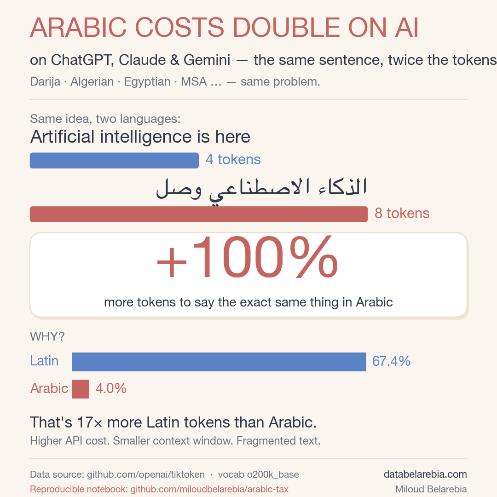

# arabic-tax

> **The same sentence costs 2× more tokens in Arabic than in English on AI.**
> Not an opinion. The mechanical result of two design choices made in 1992 and 2019.
> Affects every Arabic-script language — Darija, Algerian, Egyptian, MSA, Persian, Urdu — across **ChatGPT, Claude, Gemini**, and every major LLM.



---

## TL;DR

I downloaded OpenAI's official tokenizer file (`o200k_base`, 200,019 entries, used by GPT-4o / GPT-4.1 / GPT-5.x / o1 / o3 — verified on [platform.openai.com/tokenizer](https://platform.openai.com/tokenizer), all return identical token counts). I measured exactly how it splits the vocabulary by writing system. **Latin gets 67.4% of the dictionary. Arabic gets 4.0%. The ratio is 17 to 1.**

Direct consequence: the same idea takes about twice as many tokens in Arabic as in English on ChatGPT — more API cost, smaller usable context window, slower answers, worse output quality.

This repo holds the **reproducible Python notebook**, the **infographic**, and the **historical analysis** of why this happens.

---

## Why does this happen? A 32-year-old design story

This isn't a bug. It's the **stacked consequence of two design choices** — one from 1992, one from 2019. Both were defensible at the time. Neither was malicious. But together, they produce today's tax on Arabic-script users.

### 🧱 Layer 1 — UTF-8 (1992): the foundation

**What it is.** UTF-8 is the standard that decides how text is stored as bytes on disk. Every text file, every webpage, every API call uses it. It was designed by Ken Thompson and Rob Pike in September 1992, on a placemat in a New Jersey diner.

**The trade-off they made.** UTF-8 had to stay 100% backward-compatible with ASCII (the old 128-character English-only standard from the 1960s). So the design was: the 128 ASCII characters keep their old 1-byte encoding. Everything else needs more bytes.

**The mechanical result, as written in [RFC 3629](https://www.rfc-editor.org/rfc/rfc3629):**

| Unicode range | Byte cost | Examples |
|---|---:|---|
| U+0000 – U+007F | **1 byte** | `A`, `z`, digits, basic Latin |
| U+0080 – U+07FF | **2 bytes** | `é`, Greek, Cyrillic, Hebrew, **Arabic (U+0600–U+06FF)** |
| U+0800 – U+FFFF | **3 bytes** | Chinese 中, Japanese, Korean |
| U+10000 and above | **4 bytes** | Emojis 😀, rare scripts |

→ **An Arabic letter takes 2 bytes. A Latin letter takes 1 byte.** Before any AI exists. Before any tokenizer is trained. This is the foundation of how the text is stored.

**Important nuance** *(to stay rigorous when speaking publicly)*: "Arabic is 2× heavier" is true **only when compared to English in UTF-8**, at equivalent meaning. Other encodings (like UTF-16) treat Arabic and English equally. The asymmetry is *UTF-8 versus English specifically* — which happens to be the encoding the entire web and every modern AI is built on.

### 🤖 Layer 2 — The tokenizer (2019–2024): the amplifier

**What it is.** A tokenizer is the dictionary an LLM uses to break text into pieces (tokens) before reading it. Each piece is one "token" of compute and cost.

**The architectural choice.** In 2019, OpenAI's GPT-2 introduced **byte-level BPE**: instead of starting from characters, the tokenizer starts from raw UTF-8 bytes (256 of them). Then it learns which sequences of bytes appear often in the training data, and **promotes them to single tokens**.

This was a genuinely good idea — it guarantees that *any* character on Earth can be encoded (no `<unk>` tokens, full universal coverage). On paper, it's even pro-multilingual.

**Where it goes wrong.** "Universal coverage" ≠ "equal cost". The BPE algorithm only learns good groupings for what it has seen a lot of. OpenAI's training corpus is overwhelmingly English and code. So:
- English words like `function`, `the`, `intelligence` become **single tokens**
- Arabic words like الذكاء (intelligence) or الموديل (the model) **stay fragmented into 3–5 sub-tokens** each

**The UTF-8 handicap (×2 bytes) isn't corrected by the BPE — it's inherited and then amplified by under-representation in the training data.**

**Evidence: OpenAI keeps doubling the vocabulary.** Watch the trajectory:

| Year | Model | Tokenizer | Vocab size |
|---|---|---|---:|
| 2019 | GPT-2 | `r50k_base` | 50,257 |
| 2022 | `text-davinci-003` (GPT-3.5 legacy) | `p50k_base` | 50,281 |
| 2023 | GPT-3.5 / GPT-4 | `cl100k_base` | 100,277 |
| 2024 | GPT-4o, o1, o3 | **`o200k_base`** | **200,019** |

*(All four counts are `enc.n_vocab` returned by `tiktoken` itself — reproduce with `tiktoken.get_encoding(name).n_vocab`.)*

Why this race to bigger vocabularies? **Because in this architecture, it's the only way to reduce fragmentation of non-English languages.** With more vocabulary slots, BPE can finally learn a few Arabic, Chinese, Korean groupings. The famous example: *the same Chinese text that took 12 tokens in GPT-4 takes only 2 tokens in GPT-4o* — purely thanks to the larger vocab ([njkumarr](https://www.njkumar.com/gpt-o-multilingual-token-compression/)).

**My reading** *(present this as my interpretation, not an OpenAI statement)*: each tokenizer upgrade is a **patch on a structural problem** that goes back to 1992. They're buying space to soften the symptom, never fixing the root cause. Even `o200k_base`, the biggest, still gives Arabic only **4.0%** of the dictionary.

---

## The proof — numbers I measured

Run the notebook and you'll get the exact same output:

```
Script                                                  Tokens       %
---------------------------------------------------------------------
Latin (English, code, European languages)              134,868   67.43%
Arabic (MSA, Darija, Algerian, Egyptian, Persian, Urdu)  7,964    3.98%
CJK (Chinese, Japanese, Korean)                         10,584    5.29%
Other (punctuation, symbols, digits)                    46,603   23.30%

→ Latin gets 17× more dedicated tokens than Arabic.
```

And on a real sentence:

```
Artificial intelligence is here          →  4 tokens (English)
الذكاء الاصطناعي وصل                       →  8 tokens (Arabic)   ← 2× the cost
```

**+100% to express the exact same idea — on the modern AI/tech register**, exactly the vocabulary you need to talk about data, models, business. The script (`analyse_vocab_o200k.py`) runs three such pairs and measures **1.93× aggregate** — close to the +100% headline on this register.

**Caveat to stay rigorous:** the multiplier is not uniform across all Arabic. Short everyday phrases built from very frequent words (greetings, basic verbs) can land close to parity, because frequent Arabic letter clusters did make it into the BPE merges. The 2× tax bites hardest on **modern, technical, business Arabic** — which is precisely the register that matters for any product, API call, or chatbot serving Arabic-speaking users. The examples below mix **MSA** (Modern Standard Arabic) and **Darija** (Moroccan) on purpose, to show both registers carry the tax.

---

## Why I take OpenAI as the example (and why this isn't just about ChatGPT)

OpenAI is the example I measure because **`tiktoken` is the only publicly downloadable, byte-for-byte verifiable tokenizer** among the big three.

But the same pattern holds for **Claude** (Anthropic) and **Gemini** (Google). Their tokenizers are proprietary, but they:
- Are all built on top of UTF-8 (Layer 1 ⇒ Arabic starts at ×2 bytes anyway).
- Are all trained on English-dominant corpora (Layer 2 ⇒ same amplification mechanism).

The exact numbers vary across vendors, but the **structural mechanism is identical**. ~500 million Arabic-script speakers pay this tax on every major LLM, every day.

---

## Reproduce it yourself in 30 seconds

```bash
git clone https://github.com/miloudbelarebia/arabic-tax
cd arabic-tax
pip install tiktoken matplotlib arabic-reshaper python-bidi jupyter
jupyter notebook arabic_tax.ipynb
```

Or run the plain Python scripts:

```bash
python3 analyse_vocab_o200k.py     # full vocabulary analysis
python3 viz.py                     # regenerate the infographic
```

---

## What's in this repo

| File | What it does |
|---|---|
| `arabic_tax.ipynb` | **Main notebook** — runs the full analysis end-to-end |
| `analyse_vocab_o200k.py` | Standalone script: classifies the 200,019 tokens |
| `viz.py` | Generates the 1080×1080 infographic |
| `test_logic.py` | 14-case sanity check for the Unicode classifier |
| `the-arabic-tax.png` | The infographic (ready for social media) |

---

## What this means in practice

- **Higher API bills** for any product that serves Arabic-speaking users (~500M people).
- **Smaller usable context window** in Arabic — a 128k-token window shrinks to roughly 64k of useful content.
- **Worse model behavior**, because the model is reading fragmented words instead of whole units.
- **A linguistic-sovereignty issue**: the dominant AI infrastructure represents some languages as first-class and others as expensive afterthoughts. **Fixable — but only if we measure it first.**

---

## Cite this

```bibtex
@misc{belarebia2026arabictax,
  author = {Belarebia, Miloud},
  title  = {The Arabic Tax — Measuring Arabic-Script Under-representation
            in OpenAI's Tokenizer},
  year   = {2026},
  url    = {https://github.com/miloudbelarebia/arabic-tax}
}
```

---

## Sources (verified)

**Layer 1 — UTF-8:**
- [The history of UTF-8 by Rob Pike](https://www.cl.cam.ac.uk/~mgk25/ucs/utf-8-history.txt) — designed September 1992 with Ken Thompson
- [RFC 3629 — the UTF-8 specification](https://www.rfc-editor.org/rfc/rfc3629) — byte sizes, formally
- [UTF-8 — Wikipedia](https://en.wikipedia.org/wiki/UTF-8) — encoding ranges with examples

**Layer 2 — Tokenizers:**
- [openai/tiktoken on GitHub](https://github.com/openai/tiktoken) — the actual `o200k_base` vocabulary file
- [GPT-4 vs GPT-4o multilingual compression](https://www.njkumar.com/gpt-o-multilingual-token-compression/) — Chinese 12→2 tokens example

**Native Arabic tokenizer initiatives:**
- [Fanar (QCRI Qatar) on Hugging Face](https://huggingface.co/QCRI/Fanar-1-9B) — Arabic-centric LLM with native tokenizer
- [Fanar paper, arXiv](https://arxiv.org/abs/2501.13944)

---

## Author

**Miloud Belarebia** — [@miloudbelarebia](https://github.com/miloudbelarebia)
Website: [databelarebia.com](https://databelarebia.com)

## License

MIT — fork it, run it, share it.

---

*Data source: [github.com/openai/tiktoken](https://github.com/openai/tiktoken) — vocabulary `o200k_base`, measured 2026-05-18.*
*OpenAI is taken here as the verifiable example. The mechanism applies to ChatGPT, Claude, Gemini, and every modern LLM built on UTF-8.*
