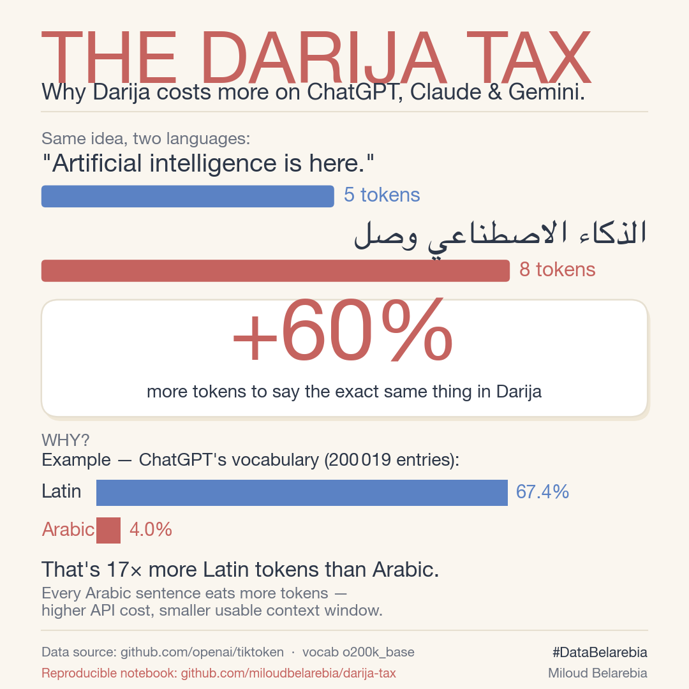

# darija-tax

> **The same sentence costs +60% more tokens in Darija than in English on ChatGPT.**
> Not an opinion — measured directly on OpenAI's official vocabulary file.



## What this repo measures

Every modern LLM reads text through a **tokenizer** — a dictionary of word-fragments
built automatically from its training data. OpenAI's tokenizer (`o200k_base`, used
by GPT-4o, GPT-4.1, GPT-5, o1, o3) contains exactly **200,019 entries**.

This repo opens that dictionary, classifies each entry by Unicode script, and
shows that:

| Script | Tokens | Share of vocabulary |
|---|---:|---:|
| Latin (English, code, European languages) | **134,868** | **67.4%** |
| CJK (Chinese, Japanese, Korean) | 10,584 | 5.3% |
| **Arabic** (MSA, Darija, Persian, Urdu — all combined) | **7,964** | **4.0%** |
| Other (punctuation, digits, symbols) | 46,603 | 23.3% |

→ **Latin gets 17× more dedicated tokens than Arabic.** And the
consequence is direct: the same idea takes more tokens in Arabic, which
means more API cost, smaller context window, slower answers, and
worse model output.

## The proof, in 3 sentences

```text
"Artificial intelligence is here."   →  5 tokens (English)
"الذكاء الاصطناعي وصل"               →  8 tokens (Darija)  ← +60%
```

The tax climbs even higher on **modern, technical Darija** — exactly the
register you need to talk about data, AI, business. Words like *data*,
*model*, *AI* are single tokens in English; in Arabic they don't exist
in the vocabulary at all and get fragmented.

> **Same pattern on Claude and Gemini.** Their tokenizers are
> proprietary so we can't measure them with the same precision, but
> they're all trained on English-dominant corpora — the asymmetry is
> structural.

## Quickstart

```bash
git clone https://github.com/miloudbelarebia/darija-tax
cd darija-tax
pip install tiktoken matplotlib arabic-reshaper python-bidi nbformat jupyter
jupyter notebook darija_tax.ipynb
```

Or, if you prefer plain Python scripts:

```bash
python3 analyse_vocab_o200k.py     # the full text analysis
python3 viz.py                     # regenerates the infographic
```

## What's in this repo

| File | What it does |
|---|---|
| `darija_tax.ipynb` | **Main notebook** — runs the full analysis end-to-end |
| `analyse_vocab_o200k.py` | Standalone script: classifies the 200,019 tokens |
| `viz.py` | Generates the 1080×1080 infographic above |
| `test_logic.py` | 14-case sanity check for the Unicode classifier |
| `taxe-darija-o200k.png` | The infographic (ready for social media) |

## Why this matters

- **Cost.** A product that serves Arabic-speaking users pays a structural
  premium on every API call.
- **Context.** A 128k-token window in English ≈ 80k of usable content
  in Darija.
- **Quality.** Tokenizers shape what models *see*. Fragmented input →
  weaker output.
- **Linguistic sovereignty.** The dominant AI stack treats some
  languages as first-class citizens and others as expensive afterthoughts.
  This is fixable — but only if we measure it first.

## Cite this

```bibtex
@misc{belarebia2026darijatax,
  author = {Belarebia, Miloud},
  title  = {The Darija Tax — Measuring Arabic Under-representation
            in OpenAI's Tokenizer},
  year   = {2026},
  url    = {https://github.com/miloudbelarebia/darija-tax}
}
```

## Author

**Miloud Belarebia** — [@miloudbelarebia](https://github.com/miloudbelarebia)
Brand: `#DataBelarebia`

## License

MIT — fork it, run it, share it.

---

*Data source: [github.com/openai/tiktoken](https://github.com/openai/tiktoken)
— vocabulary `o200k_base`, measured 2026-05-18.*
